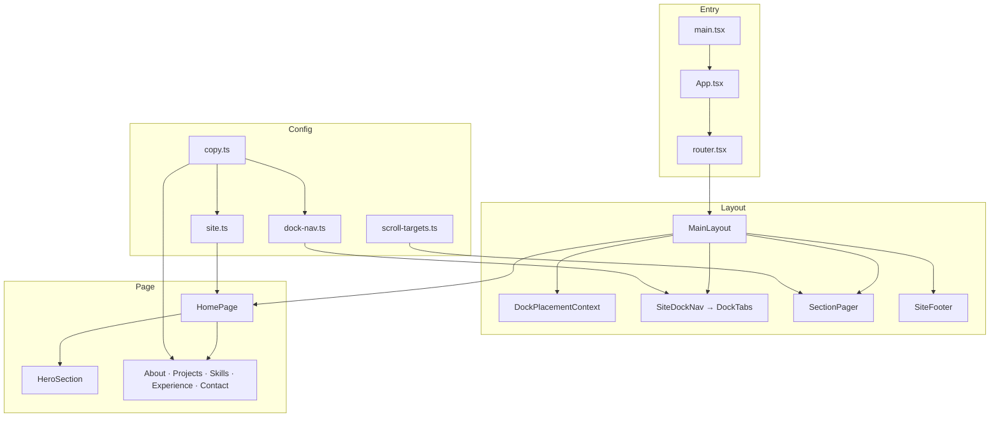

# my-portofolio

Portfolio pribadi single-page dengan nuansa macOS — hero interaktif, dock navigation mengambang, dan section scroll yang rapi. Dibangun untuk mudah dikustomisasi: ubah teks di satu file, tambah section lewat config, tanpa routing hash.

---

## Daftar Isi

- [Fitur Utama](#fitur-utama)
- [Technology Stack](#technology-stack)
- [Arsitektur](#arsitektur)
- [Memulai](#memulai)
- [Struktur Proyek](#struktur-proyek)
- [File Penting](#file-penting)
- [Kustomisasi Konten](#kustomisasi-konten)
- [Section About](#section-about)
- [Workflow Development](#workflow-development)
- [Standar Kode](#standar-kode)
- [Scripts](#scripts)

---

## Fitur Utama

| Area | Deskripsi |
|------|-----------|
| **Hero** | Background `DottedSurface` (Three.js), brand `JEFF.DEV` dengan animasi `RevealText` + hover pattern |
| **About** | Full-bleed section — latar `FaultyTerminal` (WebGL/ogl), `ProfileCard` tilt, stat counter, CTA 3D, kartu pendidikan, animasi enter/exit per blok |
| **Section titles** | Judul section (About, Projects, …) memakai `Shuffle` (GSAP) — font pixel **Press Start 2P**, replay on hover |
| **Dock Nav** | Navbar gaya macOS dock — ikon dari [theSVG](https://thesvg.org), magnification on hover, tooltip label |
| **Smart placement** | Dock di tengah saat di hero, naik ke atas saat scroll ke section lain |
| **Active section** | `IntersectionObserver` menyorot section aktif; tombol dock ke section aktif disembunyikan |
| **Section Pager** | Panah atas/bawah kanan bawah — navigasi presentasi antar section + footer; auto-hide saat mouse idle; perbaikan scroll balik hero↔about di mobile |
| **Scroll snap hybrid** | `scroll-snap` proximity untuk scroll bebas di section panjang; panah/dock lompat ketat per section; deteksi posisi scroll untuk pager |
| **Footer** | Full viewport (`100dvh`) — latar `FallingPattern` bintik hijau, teks **THANK YOU** + copyright, layer `InkReveal` (coret untuk membuka teks) |
| **Dock hide di footer** | Saat footer terlihat ≥35%, dock disembunyikan lewat `useFooterInView` |
| **Single-page scroll** | Satu route `/`, navigasi smooth scroll tanpa hash URL |
| **Copy terpusat** | Semua label, deskripsi, meta situs, config footer, about, dan animasi judul di `src/config/copy.ts` |
| **Section shell** | Projects / Skills / Experience / Contact — `SectionShell` placeholder, konten di-center vertikal (`100dvh`) |
| **A11y & motion** | `prefers-reduced-motion`, `aria-label`, scrollbar native disembunyikan |

---

## Technology Stack

| Kategori | Teknologi |
|----------|-----------|
| Runtime | React 19, TypeScript 5.8 |
| Build | Vite 7 |
| Styling | Tailwind CSS v4 (`@tailwindcss/vite`) |
| Routing | React Router DOM 7 |
| Animasi | Motion 12, GSAP 3 (`Shuffle` judul section) |
| WebGL | Three.js (hero), **ogl** (FaultyTerminal background About) |
| Ikon | [@thesvg/react](https://thesvg.org) |
| UI pattern | shadcn-style (`components.json`, alias `@/`) |
| Lint | ESLint 9 + typescript-eslint |

---

## Arsitektur



**Alur singkat**

1. `siteConfig.sections` menentukan urutan section di halaman.
2. `HomePage` merender section via `renderSection()` — hero full-width, sisanya di dalam `Container`.
3. `DockPlacementContext` memantau posisi hero dan mengatur dock `center` ↔ `top`.
4. `useActiveSection` mendeteksi section yang terlihat; `dock-tabs` menyembunyikan item aktif.
5. **Dua navigasi scroll** — dock (lompat langsung) + `SectionPager` (prev/next berurutan). Keduanya memakai `scroll-to-section.ts`.
6. Urutan pager: hero → about → … → contact → **footer** (`scroll-targets.ts`).
7. `SiteFooter` menumpuk tiga layer: `FallingPattern` (latar animasi) → teks penutup → `InkReveal` (canvas scratch di atas).
8. `useFooterInView` memantau `#footer`; saat masuk viewport, dock di-`AnimatePresence` keluar.

---

## Memulai

### Prasyarat

- Node.js 20+
- npm (atau pnpm/yarn)

### Instalasi & menjalankan

```bash
# Clone & masuk ke folder proyek
cd my-portofolio

# Install dependensi
npm install

# Development server
npm run dev

# Build production
npm run build

# Preview build
npm run preview

# Lint
npm run lint
```

Buka `http://localhost:5173` setelah `npm run dev`.

---

## Struktur Proyek

```
my-portofolio/
├── components.json          # Konfigurasi shadcn (alias, Tailwind, icon library)
├── package.json
├── vite.config.ts           # Alias @/, optimizeDeps (three, thesvg)
├── tsconfig.json
│
└── src/
    ├── main.tsx             # Entry React
    ├── App.tsx              # RouterProvider
    ├── router.tsx           # Route tunggal: /
    │
    ├── config/
    │   ├── copy.ts          # ★ Semua teks tetap (brand, section, meta SEO)
    │   ├── site.ts          # Urutan section, navigation, meta
    │   ├── dock-nav.ts      # Mapping icon dock per section
    │   ├── scroll-targets.ts # Urutan scroll pager (section + footer)
    │   └── z-index.ts       # Layering (dock, pager, hero brand, dll.)
    │
    ├── contexts/
    │   └── DockPlacementContext.tsx   # State center/top dock + hysteresis scroll
    │
    ├── hooks/
    │   ├── useActiveSection.ts        # IntersectionObserver section aktif (dock)
    │   ├── useFooterInView.ts         # Sembunyikan dock saat footer terlihat
    │   ├── usePointerActivity.ts      # Deteksi gerakan mouse untuk show/hide pager
    │   ├── useScrollY.ts              # Posisi scroll untuk logika pager
    │   └── useColorScheme.ts          # prefers-color-scheme untuk Three.js
    │
    ├── layouts/
    │   ├── MainLayout.tsx             # Shell: dock + outlet + footer
    │   ├── SiteDockNav.tsx            # Wrapper dock + activeId
    │   └── SiteFooter.tsx
    │
    ├── pages/
    │   └── HomePage.tsx               # Orchestrator semua section
    │
    ├── features/portfolio/sections/
    │   ├── index.tsx                  # sectionMap + renderSection()
    │   ├── HeroSection.tsx            # DottedSurface + HeroBrand
    │   ├── HeroBrand.tsx              # RevealText brand
    │   ├── AboutSection.tsx           # FaultyTerminal + ProfileCard + CTA + stats + education
    │   ├── ProjectsSection.tsx
    │   ├── SkillsSection.tsx
    │   ├── ExperienceSection.tsx
    │   └── ContactSection.tsx
    │
    ├── components/
    │   ├── icons/
    │   │   ├── registry.ts            # Daftar icon theSVG yang dipakai
    │   │   ├── fixed-icons.tsx        # Patch SVG tanpa fill (Stackdriver)
    │   │   ├── TheSvgIcon.tsx         # Renderer icon
    │   │   └── index.ts
    │   └── ui/
    │       ├── dock-tabs.tsx          # Dock macOS + AnimatePresence
    │       ├── section-pager.tsx      # Panah prev/next kanan bawah
    │       ├── section-heading.tsx    # Wrapper Shuffle untuk h2 section
    │       ├── shuffle.tsx            # GSAP shuffle text (React Bits)
    │       ├── section-reveal.tsx     # Fade/slide enter-exit per blok About
    │       ├── faulty-terminal.tsx    # WebGL terminal background (ogl)
    │       ├── profile-card.tsx       # Profile card tilt (React Bits)
    │       ├── profile-card.css
    │       ├── about-info-card.tsx    # Kartu stat & pendidikan About
    │       ├── btn-3d.tsx             # Tombol 3D (destructive / primary)
    │       ├── btn-3d.css
    │       ├── reveal-text.tsx        # Animasi huruf per karakter
    │       ├── falling-pattern.tsx    # Partikel jatuh — `streaks` (hero) / `dots` (footer)
    │       ├── ink-reveal.tsx         # Canvas scratch-to-reveal di footer
    │       ├── dotted-surface.tsx     # Hero Three.js
    │       ├── SectionShell.tsx       # Wrapper section placeholder
    │       └── Container.tsx
    │
    ├── styles/
    │   └── index.css                  # Tailwind v4, CSS tokens, dark mode
    │
    └── utils/
        ├── scroll-to-section.ts       # Scroll programmatic + scroll lock + scrollIntoView
        └── cn.ts                      # className helper
```

### Aset statis (`public/`)

| Path | Peran |
|------|-------|
| `public/about/picture.png` | Foto profil ProfileCard (**wajib ditambahkan** — fallback ke `avatar.svg` jika tidak ada) |
| `public/about/icon-pattern.svg` | Pola `</>` saat hover ProfileCard |
| `public/about/avatar.svg` | Placeholder avatar bawaan |
| `public/cv/cv.pdf` | File CV untuk tombol **Download CV** |

---

## File Penting

| File | Peran |
|------|-------|
| `src/config/copy.ts` | **Satu sumber teks** — `BRAND`, `SECTION_COPY`, `SITE_META`, `FOOTER`, `ABOUT`, `SECTION_TITLE` |
| `src/config/scroll-targets.ts` | Urutan target scroll pager (`sections` + `footer`) |
| `src/utils/scroll-to-section.ts` | `scrollToSection`, `scrollToAdjacent`, `getScrollTargetFromPosition` — lock snap + `scrollIntoView` |
| `src/components/ui/section-pager.tsx` | Panah atas/bawah, idle hide, `canGoUp` dari `scrollY`, `inert` saat tersembunyi |
| `src/hooks/useScrollY.ts` | Track posisi scroll untuk pager |
| `src/hooks/usePointerActivity.ts` | Show pager saat mouse/keyboard aktif (~2.2s idle) |
| `src/features/portfolio/sections/AboutSection.tsx` | Layout About — grid 2 kolom, animasi per blok |
| `src/components/ui/faulty-terminal.tsx` | Background WebGL merah glitch (ogl) |
| `src/components/ui/profile-card.tsx` | Kartu profil interaktif + tilt + fallback avatar |
| `src/components/ui/section-reveal.tsx` | Animasi fade/slide/blur enter & exit (Motion) |
| `src/components/ui/about-info-card.tsx` | Kartu stat (counter) & pendidikan |
| `src/components/ui/btn-3d.tsx` | Tombol 3D Download CV & View Projects |
| `src/components/ui/shuffle.tsx` | Animasi judul section GSAP |
| `src/components/ui/section-heading.tsx` | Wrapper `Shuffle` untuk h2 |
| `src/layouts/SiteFooter.tsx` | Komposisi footer: pattern, teks hover, ink layer |
| `src/components/ui/falling-pattern.tsx` | Animasi partikel CSS (`variant: "dots"` \| `"streaks"`) |
| `src/components/ui/ink-reveal.tsx` | Efek coret tinta di atas footer |
| `src/hooks/useFooterInView.ts` | Trigger sembunyikan dock saat scroll ke footer |
| `src/config/site.ts` | Urutan section & struktur navigasi |
| `src/config/dock-nav.ts` | Icon dock per section (slug theSVG) |
| `src/components/ui/dock-tabs.tsx` | UI dock, hide active item, tooltip |
| `src/contexts/DockPlacementContext.tsx` | Logika posisi dock saat scroll |
| `src/features/portfolio/sections/index.tsx` | Registry komponen section |

---

## Kustomisasi Konten

### Ganti teks brand & section

Edit **`src/config/copy.ts`**:

```ts
export const BRAND = {
  heroText: "JEFF.DEV",  // ← nama di hero
};

export const SECTION_COPY = {
  about: {
    label: "Tentang",
    description: "Cerita singkat...",
  },
  // ...
};

export const SITE_META = {
  name: "Nama Kamu",
  title: "Nama Kamu — Portfolio",
  description: "Deskripsi SEO...",
  locale: "id",
};
```

### Footer — teks, pattern, dan ink reveal

Edit **`FOOTER`** di `src/config/copy.ts`:

```ts
export const FOOTER = {
  thankYouText: "THANK YOU",
  pattern: {
    variant: "dots",       // "dots" = bintik bulat jatuh | "streaks" = garis vertikal (dipakai hero hover)
    color: "#2ee88a",      // warna partikel
    duration: 48,          // detik satu siklus animasi
    density: 3.5,          // kerapatan overlay (mode streaks)
    blurIntensity: "0.32rem",
    scale: 1.85,           // zoom pattern di SiteFooter
  },
  darkMaskColor: [22, 22, 28],    // RGB mask ink — dark mode
  lightMaskColor: [248, 248, 252], // RGB mask ink — light mode
};
```

**Perilaku footer**

- **Latar belakang** — `FallingPattern` dengan `variant="dots"`: bintik hijau jatuh ke bawah (bukan garis).
- **Teks** — `thankYouText` + copyright muncul saat hover footer (atau langsung terlihat jika `prefers-reduced-motion`).
- **Ink reveal** — layer canvas di atas; user menggeser kursor untuk “mengupas” tinta dan melihat teks di bawahnya. Brush size & lifetime diatur di `SiteFooter.tsx` (`brushSize`, `lifetime`).
- **Dock** — otomatis hilang saat footer cukup terlihat di viewport.

Hero hover brand tetap memakai `FallingPattern` mode **`streaks`** lewat `RevealText` (`background-clip: text`).

### Navigasi scroll — dock & section pager

Portfolio punya **dua cara navigasi** yang saling melengkapi:

| Navigasi | Lokasi | Perilaku |
|----------|--------|----------|
| **Dock** | Atas (tengah/atas saat scroll) | Lompat langsung ke section mana pun |
| **Section Pager** | Kanan bawah | Naik/turun satu section berurutan |

**Urutan pager** mengikuti `scrollTargets` di `src/config/scroll-targets.ts`:

```
hero → about → projects → skills → experience → contact → footer
```

**Scroll snap hybrid**

- **Mouse/trackpad** — scroll bebas; section panjang bisa di-scroll di dalamnya. Saat berhenti, `scroll-snap-type: y proximity` mengunci dekat awal section.
- **Panah / dock** — lompat ketat ke awal section berikutnya. Snap sementara dimatikan (`is-scroll-navigating`) supaya tidak “balik” ke posisi tengah.
- **Hero** — navigasi programmatic selalu ke `top: 0` (full layar).

**Section Pager — visibilitas**

- Muncul saat mouse bergerak atau keyboard ditekan.
- Hilang otomatis setelah ~2.2 detik tanpa aktivitas (`usePointerActivity`).
- Saat tersembunyi: `opacity: 0`, `inert`, `tabIndex={-1}` (tanpa error a11y).

**Kustomisasi idle pager** — ubah timeout di `usePointerActivity(idleMs)` dari `section-pager.tsx`.

**Perbaikan mobile (hero ↔ about)**

- Tombol **naik** aktif selama `scrollY > 0` (tidak hanya saat keluar dari section hero).
- Dari posisi antara dua section, pager memaksa scroll ke hero (`top: 0`) via `scrollIntoView`.
- Deteksi section pager memakai `getScrollTargetFromPosition()` (posisi scroll), bukan hanya IntersectionObserver.

### Ganti icon dock

Edit mapping di **`src/config/dock-nav.ts`**, lalu daftarkan import di **`src/components/icons/registry.ts`**. Cari slug di [thesvg.org](https://thesvg.org).

### Tambah / ubah urutan section

1. Tambah `SectionId` di `src/config/site.ts`
2. Tambah entry di `SECTION_COPY` (`copy.ts`)
3. Buat komponen section di `features/portfolio/sections/`
4. Daftarkan di `sectionMap` (`sections/index.tsx`)
5. Tambah icon di `dock-nav.ts` + `registry.ts`

---

## Section About

Section **About** adalah implementasi penuh pertama (bukan placeholder `SectionShell`). Section lain (Projects, Skills, …) masih memakai `SectionShell` dengan konten placeholder.

### Ringkasan perubahan About

| Area | Yang ditambahkan / diubah |
|------|---------------------------|
| **Layout** | Full-bleed (`fullWidthSectionIds`), konten di-center vertikal (`min-h-[100dvh]` + flex), grid 2 kolom desktop |
| **Background** | `FaultyTerminal` — pola digit merah WebGL (`ogl`), overlay gelap, mouse-reactive |
| **Profile card** | `ProfileCard` (React Bits) — foto full-bleed, tilt 3D, handle `@jefff.sh`, tombol Contact → scroll ke `#contact` |
| **Stat cards** | 3 kartu di bawah profile — counter animasi (Motion) saat masuk viewport |
| **CTA** | Tombol **Download CV** (`btn-3d-destructive`) & **View Projects** (`btn-3d-primary`) |
| **Education** | 2 kartu kaca — IT Del (D3 TI, lulus) & Binus (S1, berjalan) + GPA |
| **Judul** | `SectionHeading` → `Shuffle` GSAP, font pixel |
| **Animasi** | `SectionReveal` per blok — fade + slide + blur saat masuk/keluar section; backdrop terminal fade/scale |
| **Responsif** | Profile card di-center horizontal; ukuran card dari lebar (bukan `height: 80svh` yang bikin offset) |

### Layout About (desktop)

```
┌─────────────────────────────────────────────────────────┐
│  [FaultyTerminal background — full bleed]               │
│  ┌──────────────────┬──────────────────────────────────┐│
│  │  ProfileCard     │  ABOUT ME (Shuffle)              ││
│  │                  │  Deskripsi                       ││
│  │  [10+][3+][15+]  │  [Download CV] [View Projects]   ││
│  │   stats          │  [IT Del card] [Binus card]      ││
│  └──────────────────┴──────────────────────────────────┘│
└─────────────────────────────────────────────────────────┘
```

### Config About — `ABOUT` di `copy.ts`

```ts
export const ABOUT = {
  overlayOpacity: 0.52,
  terminal: {
    scale: 2.8,
    tint: "#fc0006",
    mouseReact: true,
    // ... FaultyTerminal props
  },
  profile: {
    name: "",
    title: "",
    handle: "jefff.sh",
    avatarUrl: "/about/picture.png",
    iconUrl: "/about/icon-pattern.svg",
    contactText: "Contact Me",
    enableTilt: true,
    // ...
  },
  actions: {
    cvUrl: "/cv/cv.pdf",
    cvLabel: "Download CV",
    projectsLabel: "View Projects",
  },
  education: [
    {
      badge: "Lulus",
      degree: "D3 Teknologi Informasi",
      institution: "Institut Teknologi Del",
      gpa: "4.00/4.00",
    },
    {
      badge: "Berjalan",
      degree: "S1",
      institution: "Binus University",
      gpa: "3.50/4.00",
    },
  ],
  stats: [
    { end: 10, suffix: "+", label: "Projects" },
    { end: 3, suffix: "+", label: "Tahun" },
    { end: 15, suffix: "+", label: "Tech Stack" },
  ],
};
```

**Label & deskripsi** section About tetap di `SECTION_COPY.about` (dipakai judul Shuffle + paragraf intro).

### Animasi judul section — `SECTION_TITLE`

```ts
export const SECTION_TITLE = {
  shuffleDirection: "down",
  duration: 1.5,
  shuffleTimes: 2,
  ease: "power2.out",
  triggerOnHover: true,
  respectReducedMotion: true,
  // ...
};
```

Font pixel: **Press Start 2P** (Google Fonts di `index.html`, token `--font-pixel` di `index.css`).

### Komponen About — file terkait

| Komponen | File |
|----------|------|
| Section utama | `AboutSection.tsx` |
| Background glitch | `faulty-terminal.tsx` + CSS |
| Kartu profil | `profile-card.tsx` + `profile-card.css` |
| Kartu stat & pendidikan | `about-info-card.tsx` (`AboutStatCard`, `AboutInfoCard`) |
| Tombol 3D | `btn-3d.tsx` + `btn-3d.css` |
| Animasi blok | `section-reveal.tsx` (`SectionReveal`, `SectionBackdropReveal`) |
| Judul | `section-heading.tsx` → `shuffle.tsx` |

### Perilaku animasi About

- Semua blok About memakai **`sectionInView`** dari satu `useInView` di `<section>` — sinkron masuk/keluar.
- **ProfileCard** tanpa `filter: blur` di wrapper (blur merusak render 3D tilt).
- **Stat counter** — count-up dari `0` → `end` saat kartu terlihat; `prefers-reduced-motion` → angka langsung.
- **Enter/exit** — animasi diulang setiap scroll masuk/keluar section (bukan `once`).

### Checklist aset sebelum deploy

1. Taruh foto di `public/about/picture.png`
2. Taruh CV di `public/cv/cv.pdf`
3. Isi `profile.name` & `profile.title` di `ABOUT.profile`
4. Sesuaikan angka `stats`, `education`, dan `SECTION_COPY.about.description`

---

## Workflow Development

1. Jalankan `npm run dev` — hot reload via Vite.
2. Ubah copy di `copy.ts` untuk teks; layout di komponen section masing-masing.
3. Komponen UI reusable taruh di `src/components/ui/`.
4. Config & constant taruh di `src/config/`, hindari string duplikat di banyak file.
5. Sebelum deploy: `npm run build` → `npm run preview` untuk cek production build.

---

## Standar Kode

- **TypeScript strict** — tipe eksplisit untuk config & props.
- **Alias `@/`** — import dari `src/` (lihat `vite.config.ts` & `tsconfig`).
- **Feature folders** — section portfolio di `features/portfolio/`.
- **Single source of truth** — urutan section (`site.ts`), teks (`copy.ts`), icon (`dock-nav.ts` + `registry.ts`).
- **Motion & GSAP** — hormati `useReducedMotion()` / `SECTION_TITLE.respectReducedMotion` untuk animasi non-esensial.
- **Ikon** — hanya via `@thesvg/react` + `TheSvgIcon`; patch SVG rusak di `fixed-icons.tsx`.

---

## Scripts

| Perintah | Fungsi |
|----------|--------|
| `npm run dev` | Dev server Vite |
| `npm run build` | Typecheck + bundle production → `dist/` |
| `npm run preview` | Serve folder `dist/` lokal |
| `npm run lint` | ESLint seluruh proyek |

---

